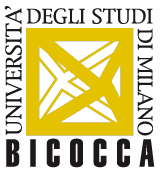

# Under construction

The CryptoAssetLab is
a scientific and technologic center
about crypto-assets (bitcoin _in primis_)
as investment opportunity, technological innovation,
and regulatory challenge.
We also pay attention to the innovations in cryptography and
blockchain technology, because of their relevance for privacy and
possible broader applications
(timestamping _in primis_, see
[OpenTimestamps](http://www.opentimestamps.org)).

We aim to be a meeting point between academia, industry,
institutions, and regulators; we encourage students, researchers,
and practitioners to join us and help with
research, development, training, teaching, and experimentation activities.

The lab is a joint initiative between the
academic and scientific community of
[Milano Bicocca University](http://www.unimib.it) and the
[Digital Gold Institute](http://www.dgi.io) (DGI) with its recognized
expertise and reputation in the crypto-ecosystem:
since 2015 Milano Bicocca has been offering a
"Bitcoin and Blockchain Technology"
seminar course, taught by Ferdinando Ametrano (DGI Executive Director).

  

## Steering Committee

[Ferdinando M. Ametrano](http://ametrano.net/about),
_scientific director_ (Digital Gold Institute)  
[Fabio Bellini](http://www.unimib.it/fabio-bellini)
(Milano Bicocca)  
[Paola A. Bongini](http://www.unimib.it/paola-agnese-bongini)
(Milano Bicocca)  
[Gianfranco Forte](http://www.unimib.it/gianfranco-forte)
(Milano Bicocca)  
[Francesca Mattasoglio](http://www.unimib.it/francesca-mattassoglio)
(Milano Bicocca)  
[Paolo Mazzocchi](http://dgi.io/#team)
(Digital Gold Institute)

## Advisory Board (_to be announced soon_)

Gregorio ......... (I.......)  
Nadia ....... (C.......)  
Paolo Gianturco (Deloitte)  
[Antonella Sciarrone Alibrandi](https://ebi-europa.eu/wp-content/uploads/2016/12/SCIARRONE-CURRICULUM-VITAE-EN-2016-2.pdf) (European Banking Institute)  
Angelo ....... (P.......)  
....... ....... (B.......)

## Save The Date

> **Crypto-Asset tra tecnologia e tentativi di regolazione**  
> _Presentazione dell’osservatorio CryptoAssetLab_  
> 5 giugno 2019, 14:30-18:00  
> Via Vizzola, 5, 20126 Milano MI  
> Università Milano Bicocca, Edificio U12

## Contact Us

address: Via Bicocca degli Arcimboldi 8, 20100 Milano (Italy)  
bulding, room: U7, 3010c  
e-mail: _to be announced soon_  
phone: _to be announced soon_
